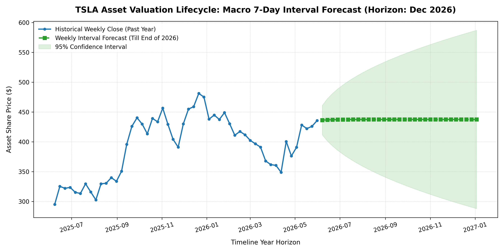
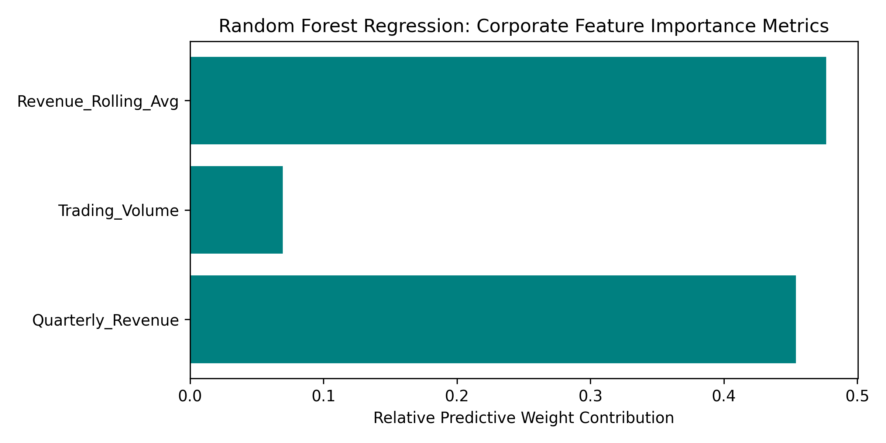

# Stock Predictive Analytics - Model Reports

This directory contains the visual outputs and performance metrics generated by machine learning and statistical forecasting models.

---

## 📈 1. Macro 7-Day Interval Forecast (SARIMAX)

* **Model Used:** SARIMAX (Univariate Time-Series)
* **Analysis:** This model tracks the macro-momentum of TSLA stock using historical 7-day closing intervals to project future asset price paths along with a 95% statistical confidence interval.

---

## 📊 2. Corporate Feature Importance Metrics (Random Forest)

* **Model Used:** Random Forest Regressor
* **Analysis:** This model evaluates relationships between underlying fundamental financial features (like Quarterly Revenue and Rolling Averages) to isolate their exact predictive weight contribution to the final asset value.